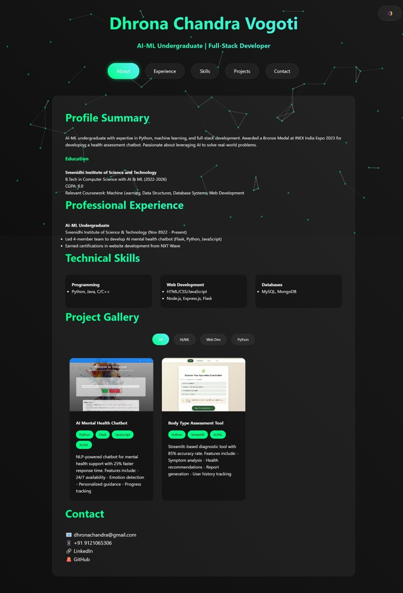
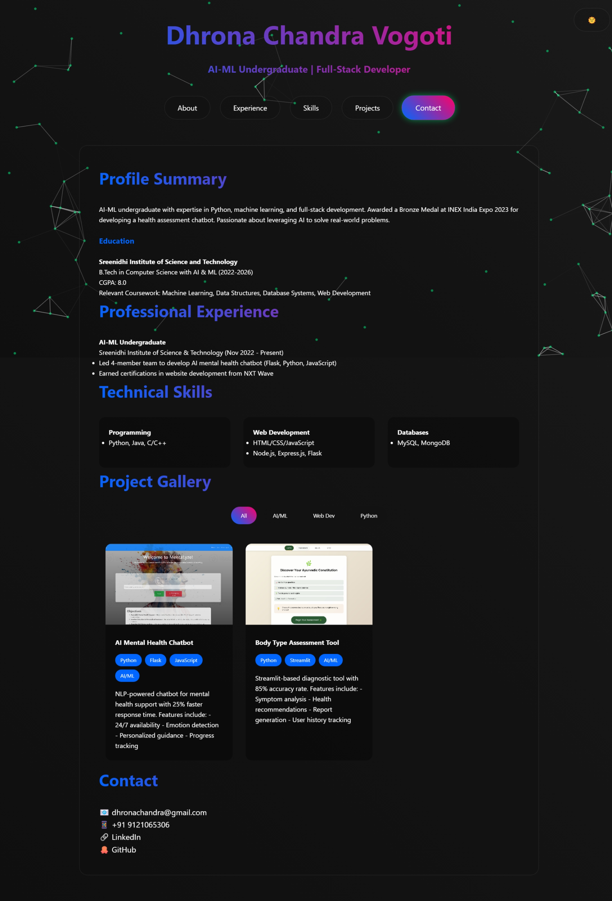

# Dhrona Chandra's Portfolio

[](https://your-portfolio-url.com)
[](https://opensource.org/licenses/MIT)

 <!-- Add your screenshot -->

A modern, responsive portfolio website showcasing projects, skills, and experience in AI/ML and full-stack development.

## ✨ Features

- **Dynamic Project Gallery** with filtering capabilities
- **Interactive Particle.js Background**
- **Theme Switching** (Light/Dark modes)
- **Smooth Scroll Navigation**
- **Responsive Design** for all screen sizes
- **Project Modals** with detailed information
- **Animated Sections** with scroll reveal effects

## 🛠️ Technologies Used

- **Frontend**: HTML5, CSS3, JavaScript
- **Animation**: Particles.js
- **Styling**: CSS Variables, Flexbox, Grid
- **Tools**: Visual Studio Code, Git

## 🚀 Installation

1. Clone the repository:

```bash
git clone https://github.com/your-username/your-portfolio-repo.git
```

2. Navigate to project directory:

```bash
cd your-portfolio-repo
```

3. Open in browser:

```bash
open index.html  # Or double-click the file
```

## 📁 Folder Structure

```
portfolio/
├── index.html
├── styles.css
├── js.js
├── images/
│   ├── chatbotInterface.png
│   └── health.jpg
└── README.md
```

## 🖥️ Usage

- Click navigation buttons to jump between sections
- Filter projects using category buttons (AI/ML, Web Dev, Python)
- Click project cards to view detailed modal
- Toggle theme using the moon/sun icon
- Scroll to trigger animations

## 📸 Screenshots

| Light Theme                                   | Dark Theme                      |
| --------------------------------------------- | ------------------------------- |
|  |  |

## 📄 License

This project is licensed under the MIT License - see the [LICENSE](LICENSE) file for details.

## 📧 Contact

Dhrona Chandra Vogoti  
📧 dhronachandra@gmail.com  
🔗 [LinkedIn](https://linkedin.com/in/dhrona007)  
💻 [GitHub](https://github.com/dhrona007)
